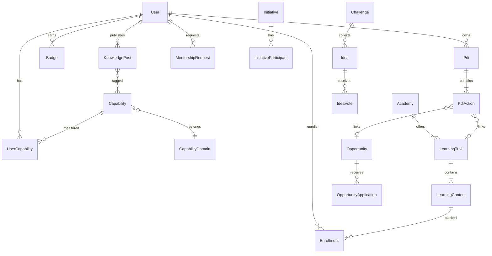

# LioTransforma — Arquitetura e Integração

> Como o módulo se encaixa no ecossistema LioConecta.

---

## 1. Posicionamento no portal

O LioTransforma será um **módulo shell** de primeira classe, seguindo o padrão dos módulos Loop, Pulse e Compass:

```
LioConecta Portal
├── Feed (home)
├── Pessoas
├── Grupos / Comunidades
├── Serviços RH
├── Documentos
├── Loop / Pulse / Compass
└── LioTransforma  ← novo módulo
```

---

## 2. Estrutura de código proposta

```
src/
├── components/transforma/
│   ├── TransformaShell.tsx          # Layout + outlet de sub-rotas
│   ├── TransformaAccessGate.tsx     # RBAC
│   ├── pages/
│   │   ├── TransformaHomePage.tsx           # Para Você
│   │   ├── TransformaExplorePage.tsx
│   │   ├── TransformaTrailsPage.tsx
│   │   ├── TransformaAcademiesPage.tsx
│   │   ├── TransformaEventsPage.tsx
│   │   ├── TransformaCapabilitiesPage.tsx
│   │   ├── TransformaMyCapabilitiesPage.tsx
│   │   ├── TransformaPdiPage.tsx
│   │   ├── TransformaCertificatesPage.tsx
│   │   ├── TransformaHistoryPage.tsx
│   │   ├── TransformaInitiativesPage.tsx
│   │   ├── TransformaChallengesPage.tsx
│   │   ├── TransformaIdeasPage.tsx
│   │   ├── TransformaCasesPage.tsx
│   │   ├── TransformaOpportunitiesPage.tsx
│   │   ├── TransformaMentorshipPage.tsx
│   │   ├── TransformaKnowledgePage.tsx
│   │   ├── TransformaInsightsPage.tsx
│   │   ├── TransformaManagerDashboardPage.tsx
│   │   └── TransformaCockpitPage.tsx
│   └── components/                  # Cards, badges, progress bars, etc.
├── config/transforma/
│   ├── navigation.ts                # Menu lateral do módulo
│   ├── academies.ts                 # Definição das 5 academias
│   └── capabilities.ts              # Taxonomia de capacidades
├── api/hooks/
│   ├── useTransformaLearning.ts
│   ├── useTransformaCapabilities.ts
│   ├── useTransformaPdi.ts
│   ├── useTransformaChallenges.ts
│   ├── useTransformaOpportunities.ts
│   ├── useTransformaMentorship.ts
│   ├── useTransformaKnowledge.ts
│   └── useTransformaInsights.ts
└── api/types/transforma.ts          # DTOs do domínio
```

---

## 3. Mapa de rotas

| Rota | Página | Epic |
|------|--------|------|
| `/transforma` | Para Você (home) | TF-01, TF-11 |
| `/transforma/explorar` | Explorar conteúdos | TF-02 |
| `/transforma/explorar/trilhas` | Trilhas de aprendizado | TF-02 |
| `/transforma/explorar/academias` | Academias corporativas | TF-05 |
| `/transforma/explorar/academias/:slug` | Detalhe academia | TF-05 |
| `/transforma/explorar/eventos` | Workshops, webinars, presenciais | TF-02 |
| `/transforma/capacidades` | Mapa de capacidades | TF-03 |
| `/transforma/capacidades/minhas` | Minhas capacidades | TF-03 |
| `/transforma/capacidades/organizacao` | Skills da organização | TF-03, TF-15 |
| `/transforma/evolucao` | Meu desenvolvimento | TF-04 |
| `/transforma/evolucao/pdi` | Meu PDI | TF-04 |
| `/transforma/evolucao/certificados` | Certificados | TF-02 |
| `/transforma/evolucao/historico` | Histórico de aprendizado | TF-02 |
| `/transforma/comunidades` | Comunidades de aprendizado | TF-05 (link Grupos) |
| `/transforma/transformacao` | Transformação em Ação | TF-06 |
| `/transforma/transformacao/iniciativas` | Iniciativas estratégicas | TF-06 |
| `/transforma/transformacao/iniciativas/:id` | Detalhe iniciativa | TF-06 |
| `/transforma/transformacao/desafios` | Desafios abertos | TF-07 |
| `/transforma/transformacao/desafios/:id` | Detalhe desafio | TF-07 |
| `/transforma/transformacao/ideias` | Banco de ideias | TF-07 |
| `/transforma/transformacao/cases` | Cases de transformação | TF-06 |
| `/transforma/oportunidades` | Oportunidades | TF-08 |
| `/transforma/oportunidades/projetos` | Projetos para aplicar skills | TF-08 |
| `/transforma/oportunidades/mentorias` | Solicitar mentoria | TF-09 |
| `/transforma/conhecimento` | Publicar / explorar conhecimento | TF-10 |
| `/transforma/conhecimento/:id` | Detalhe publicação | TF-10 |
| `/transforma/insights` | Insights pessoais | TF-01 |
| `/transforma/gestao/time` | Dashboard gestor | TF-14 |
| `/transforma/cockpit` | Cockpit diretoria | TF-15 |

---

## 4. Integrações com módulos existentes

### 4.1 Feed social (`src/components/feed/`)

| Evento LioTransforma | Post no feed |
|---------------------|--------------|
| Conclusão de trilha/curso | "🎓 {nome} concluiu {trilha}" + celebração |
| Publicação de conhecimento | "💡 {nome} publicou {título}" |
| Novo desafio aberto | "🚀 Novo desafio: {título}" |
| Badge conquistado | "🏆 {nome} conquistou badge {badge}" |
| Participação em iniciativa | "🤝 {nome} entrou em {iniciativa}" |

**Implementação:** estender `FeedPostDto` com tipos `transforma_*` ou usar post type genérico com deep-link.

### 4.2 Perfil Pessoas (`docs/pessoas-perfil.md`)

Abas/seções a enriquecer:

| Seção perfil | Dados LioTransforma |
|--------------|---------------------|
| Capacidades | Skills com nível (★) |
| Badges | Gamificação |
| Certificações | Certificados emitidos |
| Conteúdos publicados | Knowledge UGC |
| Projetos de transformação | Iniciativas + oportunidades |

### 4.3 Grupos / Comunidades (`src/api/hooks/useGroups.ts`)

- Ativar item "Comunidades" no hub Grupos (hoje placeholder `#`)
- Tipo `GROUP_TYPE_COMUNIDADE` para cohorts de trilhas e academias
- Link bidirecional: academia → comunidade relacionada

### 4.4 Biblioteca corporativa

- Área `treinamentos` existente em `biblioteca-corporativa.json`
- Migrar/associar documentos a cursos e trilhas do LioTransforma
- Vídeos e podcasts podem usar storage existente ou CDN

### 4.5 Notificações (SignalR)

| Evento | Canal |
|--------|-------|
| Treinamento obrigatório atribuído | Push + e-mail |
| Prazo de treinamento próximo | Push |
| Ação de PDI vencendo | Push |
| Mentoria solicitada/aceita | Push |
| Desafio: nova fase, votação aberta | Push |
| Oportunidade recomendada | Push |

### 4.6 Auth e RBAC

```typescript
// src/api/auth.ts — papéis propostos
type TransformaRole =
  | 'transforma:learner'      // todos colaboradores
  | 'transforma:contributor'  // publicar conhecimento
  | 'transforma:curator'      // curador de academia
  | 'transforma:mentor'       // aceitar mentorias
  | 'transforma:manager'      // dashboard do time
  | 'transforma:admin'        // CRUD conteúdos, academias
  | 'transforma:director';    // cockpit executivo

function canAccessTransformaModule(user: User): boolean;
function canAccessTransformaCockpit(user: User): boolean;
```

---

## 5. Modelo de dados (domínios)



---

## 6. API REST proposta (prefixo `/transforma/`)

### Aprendizado
```
GET    /transforma/contents?q=&type=&academy=
GET    /transforma/contents/{id}
POST   /transforma/contents/{id}/enroll
PATCH  /transforma/enrollments/{id}/progress
GET    /transforma/trails
GET    /transforma/trails/{id}
GET    /transforma/events?upcoming=true
POST   /transforma/events/{id}/register
```

### Capacidades
```
GET    /transforma/capabilities/map
GET    /transforma/capabilities/mine
PUT    /transforma/capabilities/mine/{capabilityId}
GET    /transforma/capabilities/organization
```

### PDI
```
GET    /transforma/pdi/current
POST   /transforma/pdi
PUT    /transforma/pdi/{id}
POST   /transforma/pdi/{id}/actions
PATCH  /transforma/pdi/actions/{actionId}
```

### Transformação
```
GET    /transforma/initiatives
GET    /transforma/initiatives/{id}
POST   /transforma/initiatives/{id}/join
GET    /transforma/challenges
POST   /transforma/challenges/{id}/ideas
POST   /transforma/ideas/{id}/vote
```

### Oportunidades e mentoria
```
GET    /transforma/opportunities/recommended
POST   /transforma/opportunities/{id}/apply
GET    /transforma/mentors?capability=
POST   /transforma/mentorship/requests
```

### Conhecimento
```
GET    /transforma/knowledge?q=&tags=
POST   /transforma/knowledge
GET    /transforma/knowledge/{id}
```

### Insights
```
GET    /transforma/insights/personal
GET    /transforma/insights/team          # gestor
GET    /transforma/insights/cockpit       # diretoria
```

---

## 7. Arquivos de configuração a atualizar

| Arquivo | Ação |
|---------|------|
| `src/App.tsx` | Registrar rotas `/transforma/*` |
| `src/config/navigation.ts` | Link topbar "LioTransforma" |
| `src/config/sitemap.ts` | Seção LioTransforma |
| `src/config/page-maturity.ts` | Badges `soon` → `partial` |
| `src/telemetry/routeCatalog.ts` | Módulo `transforma` |
| `src/components/layout/Sidebar.tsx` | Ícone no rail (opcional) |

---

## 8. Referências de implementação no repo

| Padrão | Referência |
|--------|------------|
| Module shell | `src/components/loop/LoopShell.tsx` |
| Navigation config | `src/config/loop/navigation.ts` |
| Access gate | `src/components/loop/LoopAccessGate.tsx` |
| Hub landing | `src/components/pages/PessoasHubPage.tsx` |
| React Query hooks | `src/api/hooks/useFeed.ts` |
| Groups integration | `src/api/hooks/useGroups.ts` |
