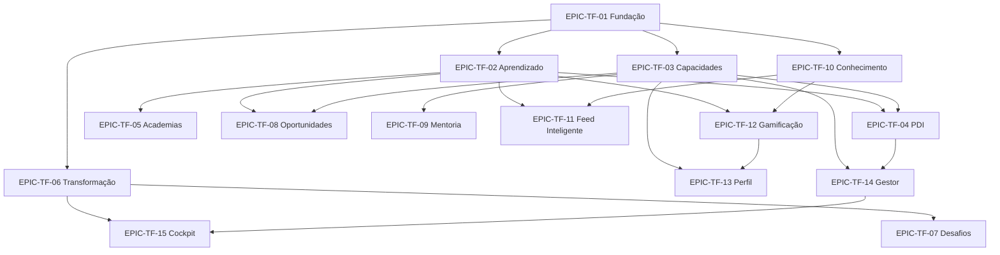

# LioTransforma — Épicos

> 15 épicos organizados por domínio de negócio.

---

## EPIC-TF-01 — Fundação do Módulo

| Campo | Valor |
|-------|-------|
| **ID** | `EPIC-TF-01` |
| **Prioridade** | Must (MVP) |
| **Release** | R5 |
| **Fase** | F5 |

### Objetivo

Estabelecer a infraestrutura do módulo LioTransforma no LioConecta: shell, navegação, RBAC, rotas, telemetry e landing "Para Você" básica.

### Escopo

- `TransformaShell` + `TransformaAccessGate`
- Menu lateral conforme arquitetura proposta
- Registro em navigation, sitemap, routeCatalog
- Home "Para Você" com placeholders para feed inteligente
- API health check e configuração backend

### Fora de escopo

- Funcionalidades de domínio (conteúdos, PDI, etc.)

### Histórias vinculadas

`US-TF-001`, `US-TF-002`, `US-TF-003`

---

## EPIC-TF-02 — Aprendizado (LMS/LXP)

| Campo | Valor |
|-------|-------|
| **ID** | `EPIC-TF-02` |
| **Prioridade** | Must (MVP) |
| **Release** | R5 |
| **Fase** | F5 |

### Objetivo

Permitir consumo, progresso e conclusão de conteúdos de aprendizado em múltiplos formatos, incluindo treinamentos obrigatórios com compliance.

### Escopo

- Catálogo de conteúdos (vídeo, documento, podcast, microlearning)
- Trilhas de aprendizado sequenciais
- Quizzes e avaliações
- Treinamentos obrigatórios com prazo e status
- Certificados de conclusão
- Eventos: workshops, webinars, presenciais (inscrição)
- Histórico de aprendizado

### Histórias vinculadas

`US-TF-004` a `US-TF-012`

---

## EPIC-TF-03 — Capacidades & Skills

| Campo | Valor |
|-------|-------|
| **ID** | `EPIC-TF-03` |
| **Prioridade** | Must (MVP) |
| **Release** | R5 |
| **Fase** | F5 |

### Objetivo

Mapear, visualizar e evoluir capacidades organizacionais e individuais com base na taxonomia de Transformação Digital e Excelência Operacional.

### Escopo

- Taxonomia hierárquica (domínio → subcapacidade)
- Mapa visual de capacidades
- Auto-avaliação e validação gestor
- Evolução por conclusão de trilhas (evidência)
- Skills da organização (agregado anonimizado)

### Histórias vinculadas

`US-TF-013` a `US-TF-017`

---

## EPIC-TF-04 — PDI Integrado

| Campo | Valor |
|-------|-------|
| **ID** | `EPIC-TF-04` |
| **Prioridade** | Must (MVP) |
| **Release** | R5 |
| **Fase** | F5 |

### Objetivo

Transformar o PDI de documento estático em plano vivo com ações vinculadas a recursos da plataforma e acompanhamento de progresso.

### Escopo

- CRUD de PDI anual por colaborador
- Objetivos e ações com status (pendente, em andamento, concluído)
- Vinculação a trilhas, workshops, mentorias, projetos
- Barra de progresso automática
- Visão gestor: PDIs do time
- Notificações de ações vencendo

### Histórias vinculadas

`US-TF-018` a `US-TF-022`

---

## EPIC-TF-05 — Academias Corporativas

| Campo | Valor |
|-------|-------|
| **ID** | `EPIC-TF-05` |
| **Prioridade** | Should |
| **Release** | R6 |
| **Fase** | F5 |

### Objetivo

Organizar conteúdos e trilhas em academias temáticas com curadoria e identidade visual própria.

### Escopo

- 5 academias: Industrial, Digital, Liderança, Negócios, Cultura
- Landing page por academia com trilhas e conteúdos
- Curadoria por papel `transforma:curator`
- Link para comunidade relacionada

### Histórias vinculadas

`US-TF-023` a `US-TF-025`

---

## EPIC-TF-06 — Transformação em Ação

| Campo | Valor |
|-------|-------|
| **ID** | `EPIC-TF-06` |
| **Prioridade** | Should |
| **Release** | R6 |
| **Fase** | F5 |

### Objetivo

Dar visibilidade a iniciativas estratégicas de transformação com participação, progresso e impacto estimado.

### Escopo

- Dashboard "Transformação em Ação" com KPIs
- Cards de iniciativas (status, progresso, participantes)
- Detalhe de iniciativa com timeline e resultados
- Cases de transformação publicados
- Inscrição de colaboradores em iniciativas

### Histórias vinculadas

`US-TF-026` a `US-TF-029`

---

## EPIC-TF-07 — Desafios de Transformação

| Campo | Valor |
|-------|-------|
| **ID** | `EPIC-TF-07` |
| **Prioridade** | Should |
| **Release** | R6 |
| **Fase** | F5 |

### Objetivo

Habilitar desafios abertos com fluxo colaborativo de ideias, votação, formação de equipes e fases até escala.

### Escopo

- Publicação de desafios pela diretoria/curadores
- Submissão de ideias com comentários
- Votação e seleção
- Fases: Desafio → Ideias → Seleção → Experimentação → Piloto → Escala
- Formação de equipes
- Contadores: ideias, participantes, dias restantes

### Histórias vinculadas

`US-TF-030` a `US-TF-034`

---

## EPIC-TF-08 — Oportunidades

| Campo | Valor |
|-------|-------|
| **ID** | `EPIC-TF-08` |
| **Prioridade** | Should |
| **Release** | R6 |
| **Fase** | F5 |

### Objetivo

Conectar aprendizado a aplicação prática via recomendação de projetos e oportunidades de colaboração baseadas em skills.

### Escopo

- Motor de recomendação: trilha concluída → oportunidades
- Cards de oportunidade (projeto, área, dedicação, skills)
- Candidatura "Quero participar"
- Integração com PDI (ação vinculada)
- Publicação de oportunidades por gestores

### Histórias vinculadas

`US-TF-035` a `US-TF-038`

---

## EPIC-TF-09 — Mentoria & Especialistas

| Campo | Valor |
|-------|-------|
| **ID** | `EPIC-TF-09` |
| **Prioridade** | Could |
| **Release** | R7 |
| **Fase** | F5 |

### Objetivo

Identificar especialistas internos por capacidade e facilitar solicitações de mentoria, shadowing e sessões de dúvidas.

### Escopo

- Diretório de especialistas com rating e área
- Opt-in para ser mentor (`transforma:mentor`)
- Tipos: mentoria, conversa, dúvidas, shadowing, acompanhamento
- Fluxo solicitação → aceite → conclusão → avaliação
- Integração com PDI

### Histórias vinculadas

`US-TF-039` a `US-TF-042`

---

## EPIC-TF-10 — Compartilhamento de Conhecimento

| Campo | Valor |
|-------|-------|
| **ID** | `EPIC-TF-10` |
| **Prioridade** | Should |
| **Release** | R6 |
| **Fase** | F5 |

### Objetivo

Permitir que colaboradores autorizados publiquem e compartilhem conhecimento organizacional, quebrando silos.

### Escopo

- Publicação: artigo, vídeo, tutorial, case, checklist, apresentação
- Tags e capacidades associadas
- Distribuição: LioTransforma, feed social, comunidade, recomendações
- Moderação por curadores
- Métricas: visualizações, reações, comentários

### Histórias vinculadas

`US-TF-043` a `US-TF-046`

---

## EPIC-TF-11 — Feed Social Inteligente

| Campo | Valor |
|-------|-------|
| **ID** | `EPIC-TF-11` |
| **Prioridade** | Should |
| **Release** | R6 |
| **Fase** | F5 |

### Objetivo

Personalizar a home "Para Você" com atividades relevantes de aprendizado, transformação e rede.

### Escopo

- Feed algorítmico: conclusões, publicações, desafios, badges
- Celebrações (parabenizar conclusão de trilha)
- Recomendações de conteúdo e trilhas
- Integração bidirecional com feed global LioConecta

### Histórias vinculadas

`US-TF-047` a `US-TF-049`

---

## EPIC-TF-12 — Gamificação Corporativa

| Campo | Valor |
|-------|-------|
| **ID** | `EPIC-TF-12` |
| **Prioridade** | Could |
| **Release** | R7 |
| **Fase** | F5 |

### Objetivo

Reconhecer contribuições com badges elegantes e critérios transparentes, sem infantilizar.

### Escopo

- Badges: Especialista, Mentor, Multiplicador, Inovador, Transformador, Colaborador, Explorador Digital, Aprendizado Contínuo
- Regras de conquista automática
- Exibição no perfil e feed
- Painel "Minhas conquistas"

### Histórias vinculadas

`US-TF-050` a `US-TF-051`

---

## EPIC-TF-13 — Perfil Integrado

| Campo | Valor |
|-------|-------|
| **ID** | `EPIC-TF-13` |
| **Prioridade** | Should |
| **Release** | R6 |
| **Fase** | F5 |

### Objetivo

Enriquecer o perfil social do colaborador com dados do LioTransforma.

### Escopo

- Seções: Capacidades, Badges, Certificações, Conteúdos publicados, Projetos de transformação
- Sincronização bidirecional perfil ↔ LioTransforma
- Visibilidade configurável (público interno / time / privado)

### Histórias vinculadas

`US-TF-052` (subdividida em tasks de perfil)

---

## EPIC-TF-14 — Visão do Gestor

| Campo | Valor |
|-------|-------|
| **ID** | `EPIC-TF-14` |
| **Prioridade** | Should |
| **Release** | R7 |
| **Fase** | F5 |

### Objetivo

Dashboard para gestores acompanharem capacidades, gaps, treinamentos, PDI e riscos do time.

### Escopo

- Índice de capacidades do time
- Principais forças e gaps
- Compliance de treinamentos obrigatórios
- PDIs do time com progresso
- Especialistas e riscos de conhecimento (single point of failure)
- Visão de sucessão básica

### Histórias vinculadas

Derivadas de `US-TF-017`, `US-TF-022` + stories específicas de gestão

---

## EPIC-TF-15 — Cockpit Diretoria

| Campo | Valor |
|-------|-------|
| **ID** | `EPIC-TF-15` |
| **Prioridade** | Could |
| **Release** | R8 |
| **Fase** | F5 |

### Objetivo

Painel executivo de Capacidades e Transformação para a Diretoria de Capacidade e Transformação Digital.

### Escopo

- Capability & Transformation Cockpit
- Capacidades organizacionais por domínio (%)
- Horas de aprendizado, colaboradores ativos, gaps críticos
- Iniciativas ativas, impacto estimado
- Comunidades ativas
- Exportação PDF/Excel para reuniões de diretoria

### Histórias vinculadas

`US-TF-017` (visão org) + stories de cockpit

---

## Mapa de dependências entre épicos

